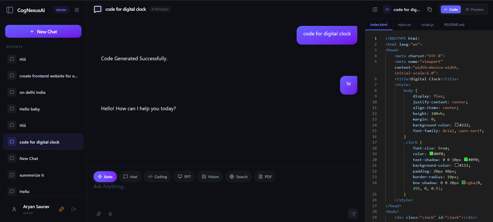
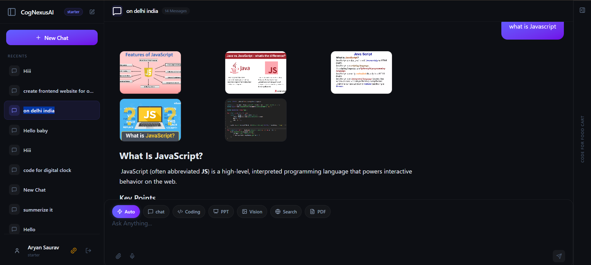
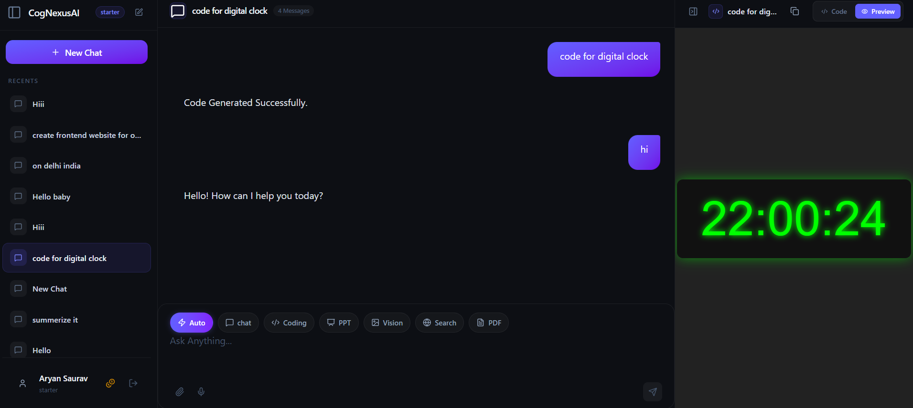
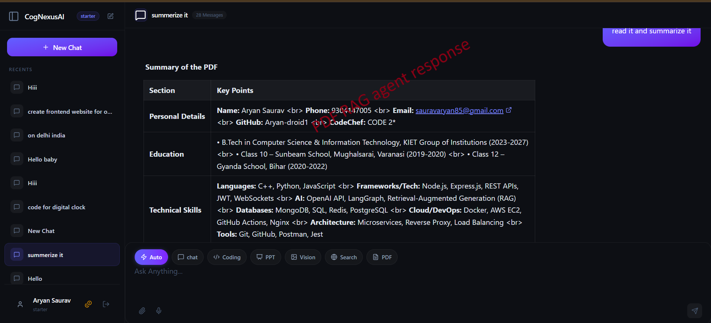
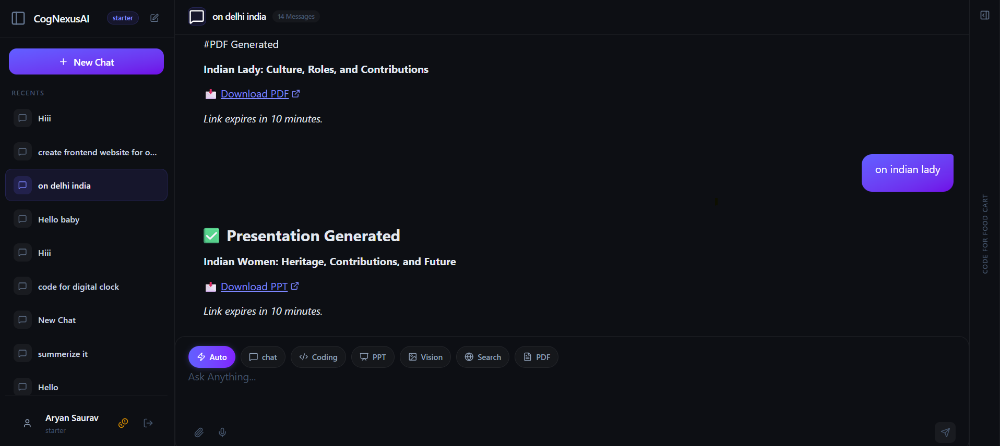
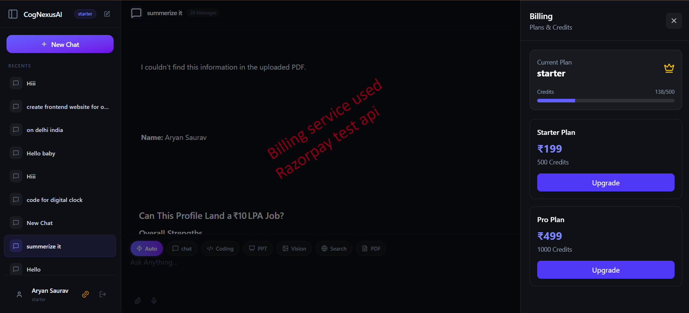
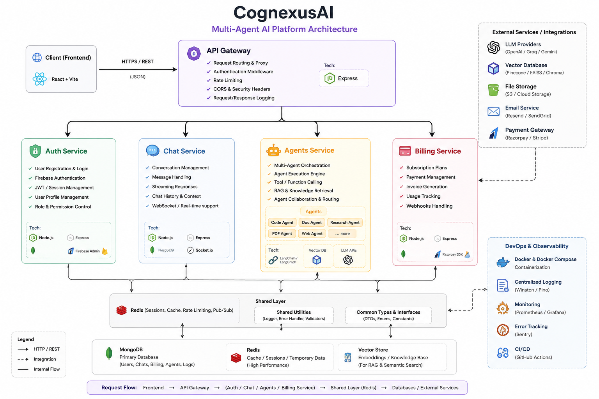

# CognexusAI

> A modular multi-agent AI platform designed around an API Gateway and independent backend services for authentication, chat, billing, and AI agent execution.

## Overview

**CognexusAI** is a multi-agent AI platform that separates core application responsibilities into independent backend services.

The platform is designed around an **API Gateway + service-oriented architecture**, allowing authentication, chat, billing, and agent execution to evolve independently while sharing common infrastructure such as Redis.

The goal is to build an AI system that is not just an LLM wrapper, but a backend platform where different AI capabilities can be exposed, orchestrated, and scaled as separate services.

## 📸 Platform Screenshots

### CognexusAI Platform


### Chat Agent


### Coding Agent


### PDF RAG Agent


### PPT Agent


### Billing


## 🧠 Multi-Agent Architecture



## Architecture

```text
                         CognexusAI
                              │
                           Frontend
                              │
                              ▼
                       ┌─────────────┐
                       │ API Gateway │
                       └──────┬──────┘
                              │
          ┌───────────────────┼───────────────────┐
          ▼                   ▼                   ▼
     Auth Service        Chat Service       Billing Service
                              │
                              ▼
                       Agents Service
                              │
                    ┌─────────┼─────────┐
                    ▼         ▼         ▼
                  Agent     Agent      Agent
                              │
                              ▼
                            Redis
```

The architecture keeps the main business domains isolated:

- **API Gateway** — single entry point for frontend requests and service routing.
- **Auth Service** — authentication, user/session management, and protected access.
- **Chat Service** — conversation and message handling.
- **Agents Service** — AI agent execution and multi-agent workflows.
- **Billing Service** — billing/subscription-related backend functionality.
- **Redis** — shared infrastructure for session and temporary/cache data.

## Core Services

### API Gateway

The gateway sits between the frontend and backend services.

Responsibilities include:

- Routing requests to backend services
- Centralizing API access
- Authentication/protection middleware
- CORS handling
- Cookie handling
- Request/response processing

The gateway allows the frontend to communicate with a single backend entry point instead of directly connecting to every service.

### Auth Service

The authentication service manages user identity and sessions.

The current implementation integrates **Firebase Authentication** for authentication and uses backend session management for authenticated requests.

Main responsibilities:

- User authentication
- Firebase ID token verification
- User creation/lookup
- Session generation
- HTTP-only session cookies
- User profile handling
- Redis-backed session storage

Example session flow:

```text
User
 │
 ▼
Frontend Authentication
 │
 ▼
Firebase ID Token
 │
 ▼
Auth Service
 │
 ├── Verify Firebase token
 ├── Create/find user
 ├── Generate session ID
 │
 ▼
Redis
 │
 └── Store session
 │
 ▼
HTTP-only Cookie
```

### Chat Service

The chat service provides the application-facing conversation layer.

It is responsible for handling chat requests and connecting the conversational interface with the AI/agent layer.

This separation allows chat-related functionality to evolve without tightly coupling it to authentication, billing, or the gateway.

### Agents Service

The Agents Service is the core AI execution layer of CognexusAI. It uses a graph-based multi-agent workflow in which a **Router Agent** determines which specialized agent should handle the user's request.

The current agent graph is:

```text
START
  │
  ▼
Router Agent
  │
  ├──────────────► Chat Agent ──────────────► END
  │
  ├──────────────► Search Agent ────────────► Chat Agent ─────► END
  │
  ├──────────────► Coding Agent ───────────► END
  │
  ├──────────────► PDF Agent ───────────────► END
  │
  ├──────────────► PPT Agent ───────────────► END
  │
  ├──────────────► Image Generation Agent ─► END
  │
  ├──────────────► Image Analyzer ──────────► END
  │
  └──────────────► PDF RAG Agent ───────────► END
```

#### Agent Routing

The **Router Agent** is the decision layer. It analyzes the incoming request and routes it to the appropriate specialized agent.

| Agent | Responsibility |
|---|---|
| **Router Agent** | Determines which agent should handle the request |
| **Chat Agent** | Handles general conversational requests and produces the final response |
| **Search Agent** | Performs search/retrieval tasks and passes the retrieved information to the Chat Agent |
| **Coding Agent** | Handles programming and code-generation tasks |
| **PDF Agent** | Handles PDF/document-related workflows |
| **PPT Agent** | Generates and works with presentation content |
| **Image Generation Agent** | Handles image-generation requests |
| **Image Analyzer** | Analyzes and extracts information from images |
| **PDF RAG Agent** | Performs retrieval-augmented generation over PDF/document knowledge |

The **Search Agent → Chat Agent → END** path is intentional. The Search Agent retrieves relevant information, then the Chat Agent uses that information to produce the final conversational response.

The other specialized agents connect directly to the `END` node after completing their respective workflows.

This graph-based design allows new specialized agents to be added without turning the entire AI system into a single monolithic workflow.

## Shared Infrastructure

### Redis

Redis is used as shared high-performance infrastructure across the backend.

Current use cases include:

- Authentication sessions
- Temporary data
- Caching
- Cross-service state where required

The Redis client is centralized under:

```text
Backend/shared/redis
```

This keeps Redis configuration and connection management reusable across services.

## Project Structure

```text
CognexusAI/
│
├── Backend/
│   ├── gateway/
│   │
│   ├── services/
│   │   ├── agents/
│   │   ├── Auth/
│   │   ├── billing/
│   │   └── chat/
│   │
│   ├── shared/
│   │   └── redis/
│   │
│   ├── docker-compose.yml
│   └── package.json
│
├── Frontend/
│   ├── public/
│   ├── src/
│   ├── package.json
│   └── vite.config.js
│
└── README.md
```

## Tech Stack

### Frontend

- React
- Vite
- JavaScript/TypeScript where applicable

### Backend

- Node.js
- Express.js
- REST APIs
- API Gateway
- Service-oriented backend architecture

### AI

- LLM APIs
- LangChain
- LangGraph
- Multi-agent workflows
- RAG / document-based workflows
- Tool/function calling

### Authentication

- Firebase Authentication
- Firebase Admin SDK
- HTTP-only cookies
- Session-based authentication

### Data & Infrastructure

- MongoDB
- Redis
- ioredis
- Docker
- Docker Compose
- Qdrant vector DataBase

## Request Flow

A typical request follows this architecture:

```text
Frontend
   │
   ▼
API Gateway
   │
   ├──────────────► Auth Service
   │
   ├──────────────► Chat Service
   │                         │
   │                         ▼
   │                   Agents Service
   │                         │
   │                         ▼
   │                    Router Agent
   │                         │
   │              ┌──────────┼──────────────────────────────┐
   │              ▼          ▼          ▼       ▼      ▼     ▼
   │         Chat Agent   Search     Coding    PDF    PPT   ...
   │              ▲        Agent      Agent   Agent   Agent
   │              │          │          │       │      │
   │              └──────────┘          └───────┴──────┴──► END
   │
   └──────────────► Billing Service

Shared infrastructure
        │
        ▼
      Redis
```

The exact multi-agent flow is:

```text
START
  │
  ▼
Router Agent
  │
  ├──► Chat Agent ───────────────► END
  │
  ├──► Search Agent ────────────► Chat Agent ─────► END
  │
  ├──► Coding Agent ────────────► END
  │
  ├──► PDF Agent ───────────────► END
  │
  ├──► PPT Agent ───────────────► END
  │
  ├──► Image Generation Agent ──► END
  │
  ├──► Image Analyzer ──────────► END
  │
  └──► PDF RAG Agent ───────────► END
```

The **Search Agent is the only specialized agent that routes back to the Chat Agent** before reaching `END`. This allows retrieved information to be converted into a final natural-language response.

## Authentication & Session Architecture

CognexusAI uses Firebase for authentication while maintaining backend-controlled sessions.

After successful authentication:

1. The client obtains a Firebase authentication token.
2. The token is sent to the backend.
3. The Auth Service verifies the token using Firebase Admin.
4. The corresponding user is created or retrieved.
5. A server-side session ID is generated.
6. The session is stored in Redis.
7. The session ID is returned as an HTTP-only cookie.
8. Subsequent protected requests use that cookie.

This approach avoids exposing the session identifier to frontend JavaScript and allows the backend to invalidate or expire sessions independently.

## Local Development

### Prerequisites

Make sure you have:

- Node.js
- npm
- Docker
- Docker Compose
- Firebase project/configuration
- Required AI provider API keys
- MongoDB connection
- Redis

### Clone

```bash
git clone https://github.com/<your-username>/CognexusAI.git
cd CognexusAI
```

### Install dependencies

Backend:

```bash
cd Backend
npm install
```

Frontend:

```bash
cd ../Frontend
npm install
```

### Environment Variables

Create environment files locally based on the provided `.env.example` files.

Never commit real secrets.

Example:

```env
MONGODB_URI=<your-mongodb-uri>
REDIS_URL=redis://localhost:6379
JWT_SECRET=<your-secret>
```

Use the variables required by the individual services in your local configuration.

### Start Redis / Infrastructure

From the backend directory:

```bash
docker compose up -d
```

### Start the Backend

Start the gateway and required services according to the package scripts/configuration in the repository.

### Start the Frontend

```bash
cd Frontend
npm run dev
```

The Vite development server will provide the frontend URL in the terminal.

## Engineering Highlights

### Service Separation

Authentication, chat, billing, and AI agents are separated into independent services. This reduces coupling and makes individual components easier to maintain and scale.

### API Gateway

The gateway provides a centralized entry point for the frontend and keeps service discovery/routing away from the client.

### Redis Sessions

Redis provides fast server-side session storage and avoids relying exclusively on application memory for authentication state.

### Multi-Agent Architecture

Instead of treating the LLM as a single monolithic component, CognexusAI separates AI capabilities into specialized agents and workflows.

### Containerized Infrastructure

Docker and Docker Compose make local infrastructure reproducible and simplify running services such as Redis.

## Security Considerations

- Secrets are stored in environment variables.
- `.env` files should never be committed.
- Authentication tokens are verified server-side.
- Session identifiers are stored in HTTP-only cookies.
- Redis-backed sessions can expire independently of the frontend.
- Gateway-level middleware can protect backend routes.

## Current Status

CognexusAI is currently maintained as a completed project/portfolio implementation.

The architecture is intentionally modular so additional agents, tools, integrations, and services can be added without restructuring the entire application.

## Future Improvements

Potential extensions include:

- Independent deployment of each service
- Horizontal scaling of agent workers
- Queue-based asynchronous agent execution
- More advanced agent observability
- Usage-based billing
- Distributed tracing
- Centralized metrics and monitoring
- More agent-specific RAG pipelines
- Automated CI/CD
- Production-grade secrets management

## Why CognexusAI?

The project focuses on a practical engineering challenge:

> **How do you turn multiple AI capabilities into a maintainable backend platform instead of building one large LLM-powered application?**

CognexusAI addresses this by combining:

- API gateway architecture
- Independent backend services
- Authentication and session management
- Redis infrastructure
- AI agent orchestration
- RAG workflows
- Containerized development

## Author

**Aryan Saurav**

Backend & AI Engineer

- C++
- Python
- TypeScript / JavaScript
- Node.js
- AI Agents
- Distributed Backend Systems

---

If you find the project interesting, feel free to explore the repository and its individual services.
